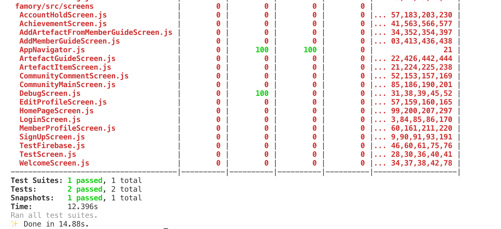

# Testing

## Automated Testing

Automated testing involves usage of **Jest**, a JavaScript Testing Framework with a focus on simplicity. We developed some lightweight testing for this. Sample testing command line argument is as follows:

```
$ yarn test
```


 Automated testing is a bit tricky due to the limitation of Expo React Native. We installed a lot of dependencies in configuration to let it work partly. Hence the automated testing will only test a small part of the application.


Sample output:



## Manual Testing

Manual testing involves testing in development, for example, check if a certain feature \(e.g. add to Firebase storage, add artefact from scratch, etc.\) works. The features to check are listed in **Trello** and will be moved to "Done" card when finished.

### Acceptance Testing

Performed to check if the flow of program is as per expectations of users or not and that all functionalities are working as per expectations. We first define the acceptance criteria, which aligns with the user story we developed in sprint 2 \(See Github "documentation" folder for more details\). Then we derive the test steps to be performed and give to user for testing. Our client was very satisfied with the testing results.

### Backend Testing

A primary focus was put on backend testing as the client requires a decent, efficient and secure backend. We tested the database by carefully checking if each function in the application works. For example, adding members will add an entry to the Member collection, and deleting items will NOT cause troubles like deleting other members by mistake. We also checked that our database was secure using Firebase Authentication.

### **Compatibility Testing**

The application is designed for Android, but it can also be run on iOS with some components not working as expected. However, since our client is Android user this is not an issue under consideration. However, we may fix it if our client is expanded.

### End to End Testing

We are performing end to end testing at the moment, focusing on the workflow from the beginning \(Welcome page\) to the end. This basically sets up for the final demonstration.

### GUI Testing

The client is generally satisfied with our UI design. We gave him a sample of our application and different components to view, like community, homepage etc.


